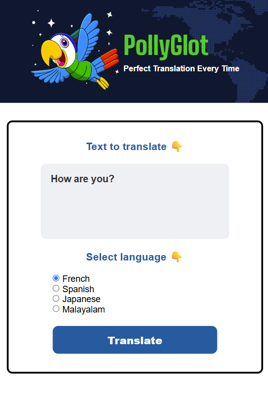

# PollyGlot 🌍🦜

PollyGlot is a simple web application that translates user input text into multiple languages using an OpenAI-powered Cloudflare Worker. The app features a clean user interface, language selection options, and responsive interaction for a smooth translation experience.

## 🌟 Features

- Translates text from English to:
  - French
  - Spanish
  - Japanese
  - Malayalam
- Clean and responsive UI
- Uses OpenAI's `gpt-4o-mini` model (via a secure Cloudflare Worker proxy) for accurate and efficient translations
- "Start Over" button to reset the translation

## 📁 Project Structure

```
📦 PollyGlot
├── index.html        # Main HTML file
├── index.css         # Styling for the app
├── index.js          # JavaScript for translation logic and UI handling
└── assets/
    └── parrot.png    # Logo image of PollyGlot
    └── worldmap.png  # Header background image
```

## 🚀 Getting Started

### 1. Clone the repository
```bash
git clone https://github.com/your-username/pollyglot.git
cd pollyglot
```

### 2. No API Key or Backend Setup Needed!
PollyGlot uses a hosted Cloudflare Worker as a secure proxy for the OpenAI API.  
**You do not need to provide your own OpenAI API key or set up a backend.**

### 3. Start a Local Server
Use any static server like `live-server`, `vite`, or `http-server`, or open `index.html` in your browser directly.

Example with live-server:

```bash
npx live-server
```

## 🔐 Note
Your API requests are securely proxied through  
`https://openai-api-worker1.vipinkaniyanthara.workers.dev/`  
so your OpenAI credentials are never exposed in frontend code.

## 📸 Screenshot




## 🛠️ Tech Stack

- HTML
- CSS
- JavaScript (ES Modules)
- OpenAI API (via Cloudflare Worker)

## 📄 License

MIT License. See [LICENSE](LICENSE)